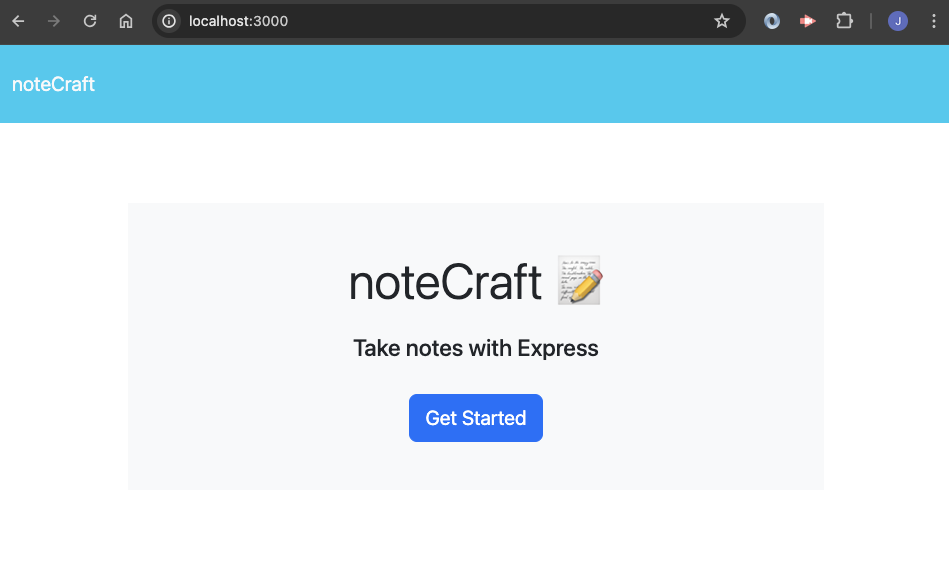
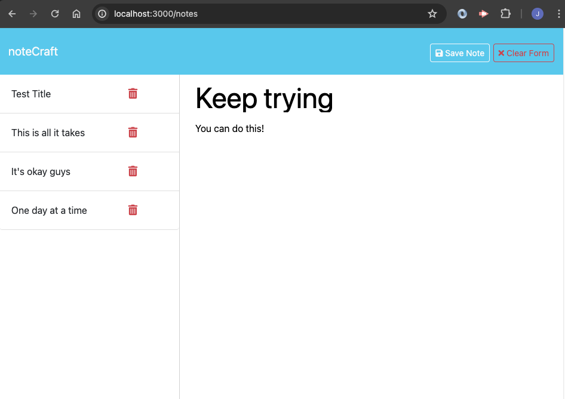

# noteCraft

## Description

This app allows it's users to enter as many notes as they would like and it also allows users to delete notes as well. It's all possible by leveraging HTML routes: GET, POST, and DELETE. The GET/notes route returns the notes.html file and the GET* route returns the index.html file. Then the GET/api/notes route reads the db.json file and returns all saved notes as JSON. Finally the POST/api/notes route receives the new note, saves the new note to the request body, adds the new note to the db.json file with a unique id and then returns it to the client. 

Finally, I was able to use the DELETE/api/notes/:id to receive a query parameter that contains the specified note ID to delete each note instead of deleting the entire db.json file. 

## Usage

## Finished Product

## License

## Credits

- Used this website to for adding usage badges
    - **<https://ileriayo.github.io/markdown-badges/>**

## Render Live Link

<https://notecraft-app.onrender.com/>

## GitHub Repo

<https://github.com/joegruff16/noteCraft>